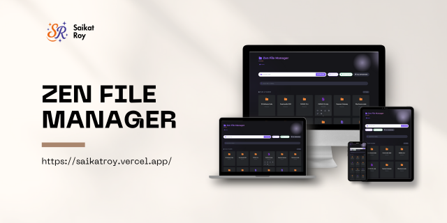

# 📁 Zen File Manager

[](LICENSE)
[](https://php.net)
[](CONTRIBUTING.md)
[](https://github.com/yourusername/zen-file-manager)

<div align="center">
  
  <p><em>Version 1.0.0 - Released June 2025</em></p>
</div>

## ✨ Overview

Zen File Manager is a clean, modern, and intuitive web-based file management solution that enables you to effortlessly browse, manipulate, and organize your files and directories through a beautiful, responsive interface. Built with PHP and modern web technologies, it provides a seamless file management experience directly from your browser with built-in authentication for enhanced security.

## 🚀 Features

- **📂 File Operations**
  - Browse files and folders with an intuitive UI
  - Create, rename, copy, cut, and paste files/folders
  - Delete files/folders with confirmation
  - Real-time search and filtering capabilities

- **📤 Upload & Download**
  - Easy drag-and-drop file uploads
  - Multiple file upload support
  - Direct file downloads
  - ZIP file extraction

- **👁️ Preview & View**
  - View text files directly in the browser
  - Preview images and documents
  - Code syntax highlighting for common file types
  - Render HTML files in a preview pane

- **🔐 Security**
  - Path traversal prevention
  - Configurable base directory restriction
  - File operation validations
  - Session-based buffer management

- **💻 User Interface**
  - Clean, modern responsive design
  - Breadcrumb navigation for easy directory traversal
  - Intuitive status messages
  - Keyboard shortcuts support
  - Dark/Light theme support (coming soon)

## 📋 Requirements

- PHP 7.4 or higher
- Web server with PHP support (Apache, Nginx, etc.)
- Modern browser (Chrome, Firefox, Safari, Edge)
- Session support enabled in PHP

## 🔧 Installation

1. **Clone the repository**:
   ```bash
   git clone https://github.com/yourusername/zen-file-manager.git
   ```

2. **Move to your web server directory**:
   For XAMPP users:
   ```bash
   # On Windows
   xcopy /E /I zen-file-manager C:\xampp\htdocs\file-manager\
   
   # On Linux/macOS
   cp -R zen-file-manager /opt/lampp/htdocs/file-manager/
   ```
   
   For other web servers:
   ```bash
   mv zen-file-manager /path/to/your/webserver/
   ```

3. **Configure the base directory**:
   Edit `includes/config.php` to set your desired base directory.
   ```php
   define('BASE_DIR', '/absolute/path/to/directory');
   ```

4. **Set proper permissions** (Linux/macOS only):
   ```bash
   chmod -R 755 /path/to/file-manager
   ```

5. **Access through your web browser**:
   ```
   http://localhost/file-manager/
   ```
   
   You'll be directed to the login page for authentication.

## 🖥️ Usage

### Basic Navigation
- Click on folders to navigate into them
- Use the breadcrumb navigation to move back up
- Use the "Parent Directory" button to go one level up

### File Operations
1. **Create new file/folder**:
   - Click "New File" or "New Folder"
   - Enter name in the modal
   - Click "Create"

2. **Rename files/folders**:
   - Click the rename icon (✏️) next to the file/folder
   - Enter new name
   - Click "Rename"

3. **Copy, Cut & Paste**:
   - Click "File Operations" button
   - Select files/folders
   - Click "Copy" or "Cut"
   - Navigate to target directory
   - Click "Paste Here"

4. **Upload files**:
   - Click "Choose File" or drag files to the upload area
   - Click "Upload"

### Advanced Features
- **Extract ZIP files**: Click the extract icon next to any ZIP file
- **View Code Files**: Click the code icon to view file contents
- **Filter/Search**: Type in the search box to filter files in the current directory

## 🎨 Customization

### Styling
Edit the `assets/css/improved-styles.css` file to customize the look and feel.

### Configuration
Modify settings in `includes/config.php` to adjust behavior:
- Change the BASE_DIR setting to control access restrictions
- Add additional configuration parameters as needed

## 📚 Code Structure

```
├── assets/            # CSS, JS, and library files
│   ├── css/           # Stylesheets
│   │   └── improved-styles.css  # Main CSS file
│   ├── js/            # JavaScript files
│   │   ├── jquery.min.js        # jQuery library
│   │   └── main.js              # Main application JS
│   └── libs/          # External libraries
│       └── font-awesome/        # Icons and fonts
├── includes/          # PHP functions and modules
│   ├── config.php              # Configuration settings
│   ├── auth.php                # Authentication functions
│   ├── breadcrumbs.php         # Navigation breadcrumbs
│   ├── dir_operations.php      # Directory operation functions
│   ├── file_operations.php     # File operation functions
│   ├── file_utils.php          # File utility functions
│   ├── functions.php           # General functions
│   ├── session_manager.php     # Session handling
│   ├── template_functions.php  # UI template functions
│   ├── utils.php               # Utility functions
│   └── layout/                 # Layout templates
│       ├── error.php           # Error template
│       └── footer.php          # Footer template
├── about.php          # About page
├── help.php           # Help documentation
├── index.php          # Main application file
├── login.php          # Authentication page
├── logout.php         # Logout handler
└── support.php        # Support information
```

## 🔒 Security Considerations

- This application includes built-in authentication for basic security
- For public-facing installations, consider adding:
  - HTTPS encryption (SSL/TLS certificates)
  - Enhanced authentication mechanisms (2FA, OAuth, etc.)
  - Request rate limiting
  - IP-based access restrictions
- Regularly update your PHP version and dependencies
- Limit access to sensitive directories through proper configuration
- Back up important files before performing bulk operations
- Review all file permissions in production environments

## 🤝 Contributing

Contributions are welcome! Please feel free to submit a Pull Request.

1. Fork the repository
2. Create your feature branch (`git checkout -b feature/amazing-feature`)
3. Commit your changes (`git commit -m 'Add some amazing feature'`)
4. Push to the branch (`git push origin feature/amazing-feature`)
5. Open a Pull Request

## 📝 License

This project is licensed under the MIT License - see the LICENSE file for details.

## 🆕 What's New in Version 1.0.0 (June 2025)

- **User Authentication System** for enhanced security
- **Session Management** for improved user experience
- **Improved UI** with responsive design
- **Breadcrumb Navigation** for easy directory traversal
- **File Preview** support for multiple file types
- **Enhanced Error Handling** with detailed feedback
- **Support for Multiple Languages** (coming soon)

## 🙏 Acknowledgements

- [Font Awesome](https://fontawesome.com) for the beautiful icons
- [jQuery](https://jquery.com) for simplifying JavaScript operations
- All contributors who have invested their time and efforts

## 📬 Contact & Support

- Project Link: [https://github.com/yourusername/zen-file-manager](https://github.com/yourusername/zen-file-manager)
- For help and support, please check the [help.php](help.php) and [support.php](support.php) pages
- Submit bug reports and feature requests through GitHub Issues

---

<div align="center">
  <sub>Built with ❤️ by contributors worldwide</sub>
  <br>
  <sub>Copyright © 2025 Zen File Manager. All rights reserved.</sub>
</div>
